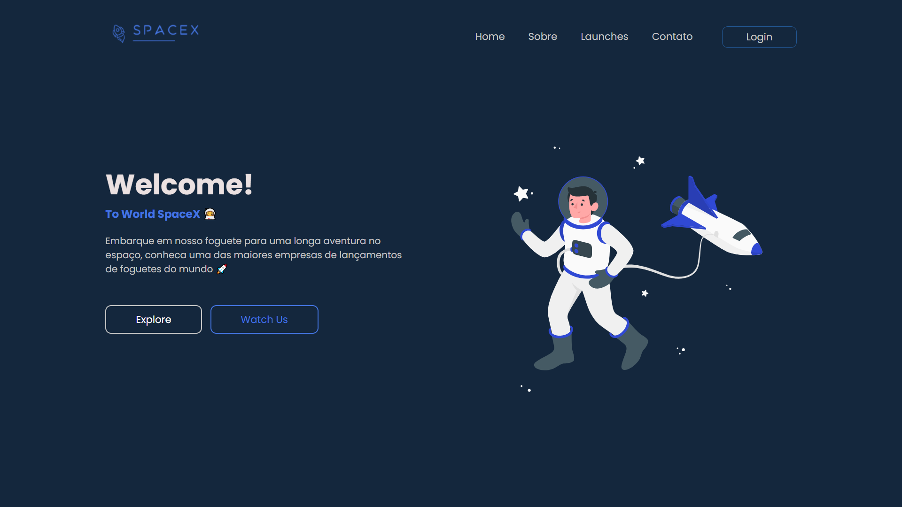

<h1>SpaceX WebSite</h1>

## 📚 About

SpaceX é um website responsivo contendo informações sobre a empresa **Space Exploration Technologies Corp**. O projeto conta com telas e navegação por menu no modo mobile, paginas como Sobre, galeria de imagens dos lançamentos e tela de login, dashboard com dados de lançamentos e receita da corporação. O projeto foi adaptado para dispositivos móveis.

## 🔨 Tools

- [HTML](https://developer.mozilla.org/pt-BR/docs/Web/HTML)
- [CSS](https://developer.mozilla.org/pt-BR/docs/Web/CSS)
- [JavaScript](https://developer.mozilla.org/pt-BR/docs/Web/JAVASCRIPT)

## 🧾 License

This project is under the MIT license. See the file LISENSE for more details.
 

<h1 align="center">
<a href="https://spacexbrweb.netlify.app/">See the site</a>
</h1>
